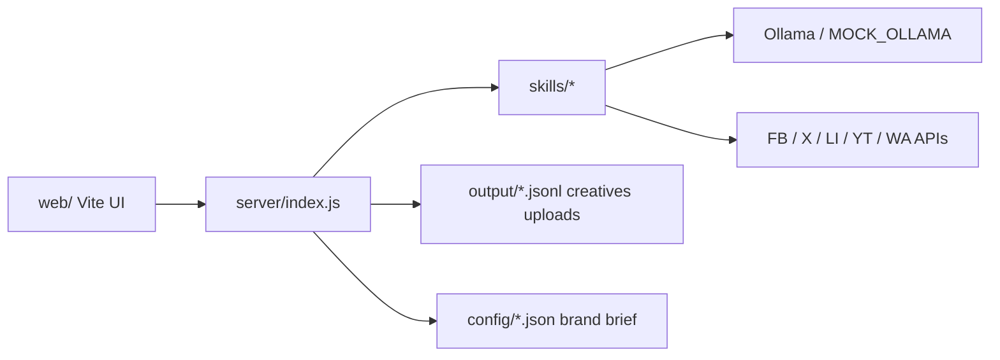

# Architecture

## Data flow

1. **Compose** — `web/src/App.jsx` collects topic, platforms, tone/language/length.
2. **Polish** — `POST /api/polish` → `skills/generate_post.js` → optional `render_creative.js`.
3. **Publish** — `POST /api/publish` → `skills/post_*.js` (dry-run by default).
4. **History** — outcomes append to `output/publish-log.jsonl`; schedule in `output/schedule.json`.

## Key paths

| Path | Role |
|------|------|
| `server/index.js` | Express API |
| `server/wave3.js` | History/schedule/drafts/compose helpers |
| `server/ops.js` | Pause, backups, stats, OpenAPI |
| `skills/` | Generate + platform publishers + auto-reply |
| `utils/` | logger, retry, errors, jsonl, circuit breaker |
| `web/` | Operator console |
| `output/` | Logs, creatives, uploads, drafts |
| `config/` | Rules, packs, flags, brand brief |
